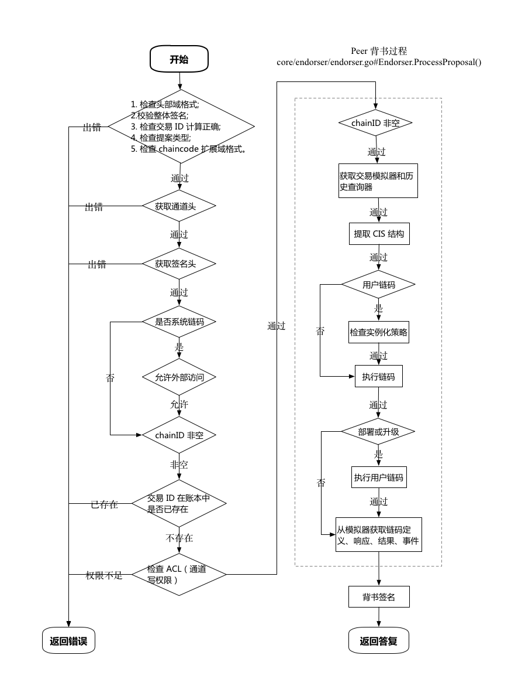

## Peer 提案背书过程

客户端将交易预提案（Transaction Proposal)通过 gRPC 发送给支持 Endorser 角色的 Peer 进行背书。

这些交易提案可能包括链码的安装、实例化、升级、调用、查询；以及 Peer 节点加入和列出通道操作。

Peer 接收到请求后，会调用 `core/endorser/endorser.go#Endorser.ProcessProposal(ctx context.Context, signedProp *pb.SignedProposal) (*pb.ProposalResponse, error)` 方法，进行具体的背书处理。

背书过程主要完成如下操作：

* 检查提案消息的合法性，以及相关的权限；
* 模拟执行提案：启动链码容器，对世界状态的最新版本进行临时快照，基于它执行链码，将结果记录在读写集中；
* 对提案内容和读写集合进行签名，并返回提案响应消息。

### 整体过程

主要过程如下图所示。

* 检查提案合法性，主要由 `core/endorser/endorser.go#Endorser.preProcess()` 方法完成；
    * 调用 ValidateProposalMessage() 方法对签名的提案进行格式检查，主要包括：
        * Channel 头部格式：是否合法头部类型，由 validateCommonHeader() 完成；
        * 校验签名头：是否包括了 nonce 和creators 数据，签名是否正确。由 checkSignatureFromCreator() 完成；
        * 计算交易 ID：是否等于 SHA256（nonce+creator），为后面探测交易冲突做准备；
        * 通道头类型：检查提案类型为 CONFIG 或 ENDORSER_TRANSACTION；
        * 检测链码格式：检查 chaincode 扩展域格式是否正确。
    * 获取通道头（ChannelHeader）和签名头（SignatureHeader）；
    * 如果是系统链码调用（SCC），检查是否是允许从外部调用的三种 SCC 之一：cscc、lscc 或 qscc；
    * 如果提案中 chainID 不为空（对于大部分需要访问账本的交易）：
        * 检查交易 ID 在本地账本结构中不存在（避免重复提交攻击）；
        * 对于用户链码调用，需要检查 ACL：资源类型为 `PROPOSE`，对应默认策略在通道上拥有写权限（`CHANNELWRITERS`）。
* 模拟执行提案，主要由 `core/endorser/endorser.go#Endorser.SimulateProposal()` 方法实现。
    * 如果 chainID 不为空，获取对应账本的交易模拟器（TxSimulator）和历史查询器（HistoryQueryExecutor），这两个结构将在后续执行链码时被使用。
    * 调用 `SimulateProposal()` 方法获取模拟执行的结果，检查返回的响应 response 的状态，若不小于错误 500 则创建并返回一个失败的 ProposalResponse。
* 对提案内容和结果中读写集合进行签名，主要由 `core/endorser/endorser.go#Endorser.endorseProposal()` 方法实现。
    * 该方法主要调用 `core/endorser/plugin_endorser.go#PluginEndorser.EndorseWithPlugin()` 方法，利用用户指定或系统默认的 ESCC 对模拟的结果进行背书处理，返回 ProposalResponse。ProposalResponse 消息中包括版本、时间戳、模拟结果、载荷和背书信息。
    * 返回响应消息 ProposalResponse。

#### SimulateProposal 方法

该方法会通过执行链码来获取对世界状态的修改结果，并存放到读写集中。主要过程如下：

* 从提案结构的载荷中提取 ChaincodeInvocationSpec 结构（Proposal.Payload.Input），其中包含了所调用链码（系统链码或用户链码）的路径、名称和版本，以及调用参数列表；
* 对于用户链码，调用之前肯定已经安装实例化过。通过 LSCC.getccdata 方法获取账本上已安装的该链码对应的 ChaincodeData 结构（包括名称、版本、Escc、Vscc、背书策略、数据、ID、实例化策略），获取其版本和实例化策略信息；
* 对于用户链码，检查提案中的实例化策略跟账本上记录的对应实例化策略（安装链码时指定）是否一致，防止有人通过伪造调用请求中的实例化权限，让安装了该链码的节点在其他通道内实例化（具体可参考 FAB-3156）。
* 调用 callChaincode() 方法执行链码提案，返回 Response 和 ChaincodeEvent。
    * 调用 `core/endorser/support.go#SupportImpl.Execute()` 方法，该方法主要进一步调用 `core/chaincode/chaincode_support.go#ExecuteChaincode()` 方法。该过程中会把交易模拟器和历史查询器通过上下文结构体进行传递。
    * `Execute()` 方法会调用 `ChaincodeSupport.Launch()` 方法创建并启动链码运行环境（对于用户链码为容器）。启动成功后创建链码 gRPC 消息，通过 `ChaincodeSupport.Execute()` 方法发送消息给链码环境，执行相关的合约，并返回执行响应（ChaincodeMessage 结构）。此过程中会将读写集记录到交易模拟器结构体中。
    * 对于通过 LSCC 来部署或升级用户链码的操作，还需要再次通过 `Execute()` 方法来初始化或升级用户链码实例。
* 对于 chainID 非空情况，执行 GetTxSimulationResults() 拿到执行结果 `TxSimulationResults` 结构，从中可以解析出读写集数据。
* 最终返回链码标准数据结构 ChaincodeDefinition、响应 pb.Response、交易读写集 PubSimulationResults、链码事件 ChaincodeEvent。

